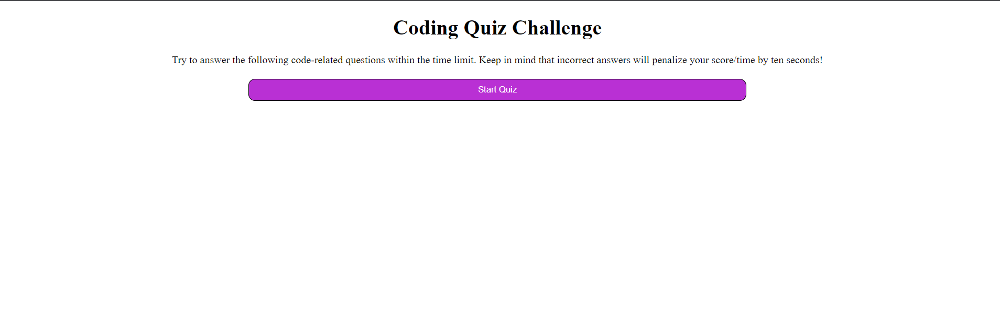

# Mini-Java-Quizzes
Utilize this to take JavaScript quizzes to practice!

## Description
Provide a short description explaining the what, why, and how of your project. Use the following questions as a guide:
- What was your motivation?
    - To create an automated quiz that grades and stores highscores within the local storage for a better interactive user experience.
- Why did you build this project? (Note: the answer is not "Because it was a homework assignment.")
    - to challenge my knowledge and understanding of JaveScript in order to create a mini quiz.
- What problem does it solve?
    - after users take the quiz they will understand if they are well versed in JavaScript or not.
- What did you learn?
    - This assignment was super tough for me, I learned that I need more practice within JavaScript! I also included a paragraph of stuff I know does not work as a request for help.

## Installation
What are the steps required to install your project? Provide a step-by-step description of how to get the development environment running.

- Create a github repo with a unique name 
- clone the https github repo URL into git using the git clone function
- type in "code ." into git once the repo is saved on your computer
- VSCode will pop up onto your desktop and within VSCode you have the ability to edit and save committed material within VSCode. 
- this is communicating with Git when you are complete with changes utilize "git add ." to sync all changes
- use "git commit -m "enter commit messages" to commit the changes into git
- use "git push origin main" as the final push into github where you will see all of your saved changes and a copy of the code. 

## Usage
Provide instructions and examples for use. Include screenshots as needed.

- website: https://amberdiehl1.github.io/Mini-Java-Quizzes/
- github: https://github.com/AmberDiehl1/Mini-Java-Quizzes

 

## Credits
List your collaborators, if any, with links to their GitHub profiles.
